# StateMinimization

Reads a completely specified STG (i.e., STG without don't care conditions) in KISS format and outputs its minimum STG in KISS format and in pictorial DOT format.

## Requirement

- gcc/clang with C++17 supported
- CMake

## Build

```bash
mkdir build
cd build
cmake -DCMAKE_BUILD_TYPE=Release ..
cmake --build .
```

## Support Platforms

GCC/Clang

## Run

```bash
./StateMinimization [input_kiss] [output_kiss] [output_dot]
```

## Feature

|          | Name                | Description                                      |
|:--------:| ------------------- | ------------------------------------------------ |
| &#x2705; | Read file           | Read the content of the pla file.                |
| &#x2705; | Handle commands     | Handle the commands from read from the pla file. |
| &#x2705; | Compatibility check | Check the compatibility of the states.           |
| &#x2705; | State merge         | Merge the states.                                |
| &#x2705; | Output file         | Output the pla format file.                      |

## Example case

### Case 1

[example/case1](./example/myTest/kiss/case1)

#### Input kiss

```kiss
.start_kiss
.i 1
.o 1
.p 14
.s 7
.r a
0 a a 0
1 a b 0
0 b c 0
1 b d 0
0 c a 0
1 c d 0
0 d e 0
1 d f 1
0 e a 0
1 e f 1
0 f g 0
1 f f 1
0 g a 0
1 g f 1
.end_kiss
```

#### Input dot

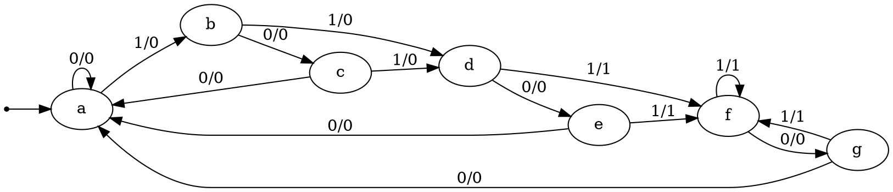
```dot
digraph STG {
	rankdir=LR;

	INIT [shape=point];
	a [label="a"];
	b [label="b"];
	c [label="c"];
	d [label="d"];
	e [label="e"];
	f [label="f"];
	g [label="g"];

	INIT -> a;
	a -> a [label="0/0"];
	a -> b [label="1/0"];
	b -> c [label="0/0"];
	b -> d [label="1/0"];
	c -> a [label="0/0"];
	c -> d [label="1/0"];
	d -> e [label="0/0"];
	d -> f [label="1/1"];
	e -> a [label="0/0"];
	e -> f [label="1/1"];
	f -> g [label="0/0"];
	f -> f [label="1/1"];
	g -> a [label="0/0"];
	g -> f [label="1/1"];
}
```

#### Input dot png

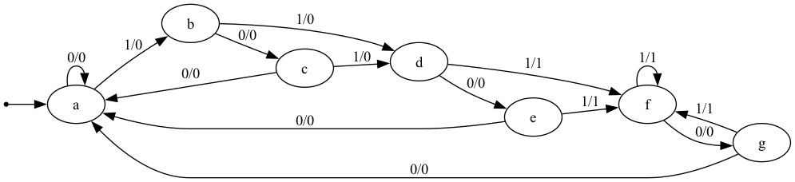


#### Output kiss

```kiss
.start_kiss
.i 1
.o 1
.p 10
.s 5
.r a
0 a a 0
1 a b 0
0 b c 0
1 b d 0
0 c a 0
1 c d 0
0 d e 0
1 d d 1
0 e a 0
1 e d 1
.end_kiss
```

#### Output dot

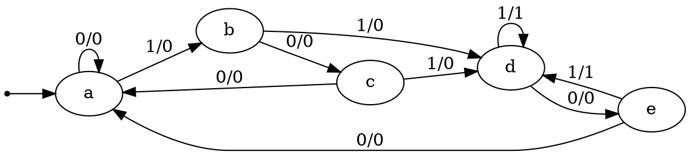
```dot
digraph STG {
    rankdir=LR;

    INIT [shape=point];
    a [label="a"];
    b [label="b"];
    c [label="c"];
    d [label="d"];
    e [label="e"];

    INIT -> a;
    a -> a [label="0/0"];
    a -> b [label="1/0"];
    b -> c [label="0/0"];
    b -> d [label="1/0"];
    c -> a [label="0/0"];
    c -> d [label="1/0"];
    d -> d [label="1/1"];
    d -> e [label="0/0"];
    e -> a [label="0/0"];
    e -> d [label="1/1"];
}
```

#### Output dot png

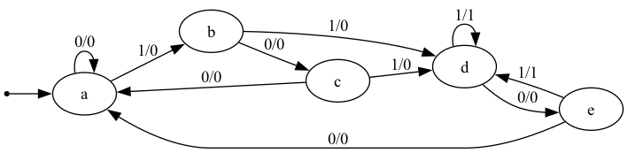


### Case 2

[example/case2](./example/myTest/kiss/case2)

#### Input kiss

```kiss
.start_kiss
.i 1
.o 1
.p 16
.s 8
.r a
0 a f 0
1 a b 0
0 b d 0
1 b c 0
0 c f 0
1 c e 0
0 d g 1
1 d a 0
0 e d 0
1 e c 0
0 f f 1
1 f b 1
0 g g 0
1 g h 1
0 h g 1
1 h a 0
.end_kiss
```

#### Input dot

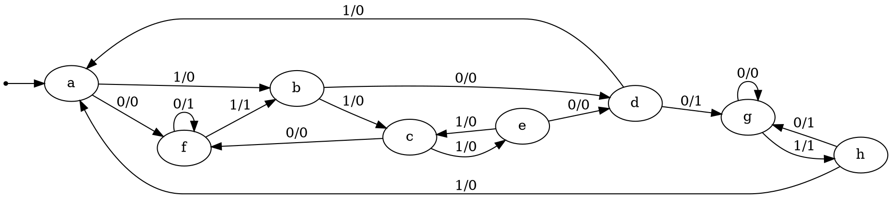
```dot
digraph STG {
	rankdir=LR;

	INIT [shape=point];
	a [label="a"];
	f [label="f"];
	b [label="b"];
	d [label="d"];
	c [label="c"];
	e [label="e"];
	g [label="g"];
	h [label="h"];

	INIT -> a;
	a -> f [label="0/0"];
	a -> b [label="1/0"];
	f -> f [label="0/1"];
	f -> b [label="1/1"];
	b -> d [label="0/0"];
	b -> c [label="1/0"];
	d -> g [label="0/1"];
	d -> a [label="1/0"];
	c -> f [label="0/0"];
	c -> e [label="1/0"];
	e -> d [label="0/0"];
	e -> c [label="1/0"];
	g -> g [label="0/0"];
	g -> h [label="1/1"];
	h -> g [label="0/1"];
	h -> a [label="1/0"];
}

```

#### Input dot png

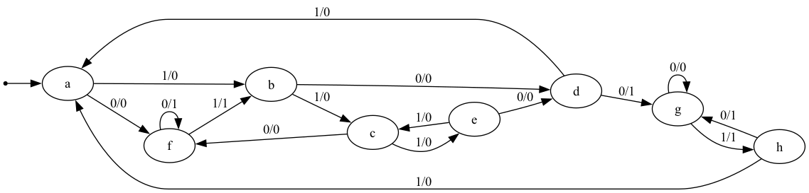


#### Output kiss

```kiss
.start_kiss
.i 1
.o 1
.p 10
.s 5
.r a
0 a f 0
1 a b 0
0 f f 1
1 f b 1
0 b d 0
1 b a 0
0 d g 1
1 d a 0
0 g g 0
1 g d 1
.end_kiss
```

#### Output dot

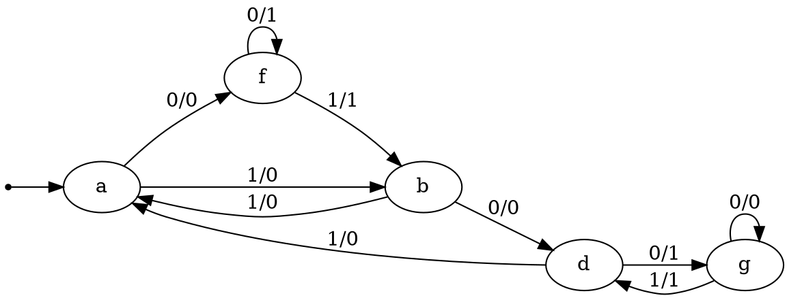
```dot
digraph STG {
    rankdir=LR;

    INIT [shape=point];
    a [label="a"];
    f [label="f"];
    b [label="b"];
    d [label="d"];
    g [label="g"];

    INIT -> a;
    a -> b [label="1/0"];
    a -> f [label="0/0"];
    f -> b [label="1/1"];
    f -> f [label="0/1"];
    b -> a [label="1/0"];
    b -> d [label="0/0"];
    d -> a [label="1/0"];
    d -> g [label="0/1"];
    g -> d [label="1/1"];
    g -> g [label="0/0"];
}
```

#### Output dot png

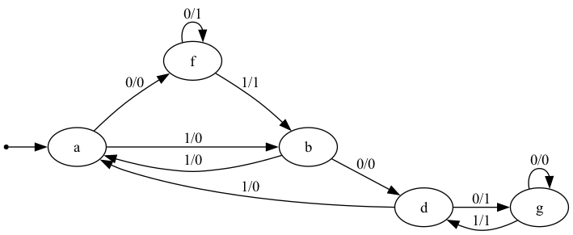


### Case 3

[example/case3](./example/myTest/kiss/case3)

#### Input kiss

```kiss
.start_kiss
.i 1
.o 1
.p 30
.s 15
.r s0
0 s0 s1 0
1 s0 s2 0
0 s1 s3 0
1 s1 s4 0
0 s2 s5 0
1 s2 s6 0
0 s3 s7 0
1 s3 s8 0
0 s4 s9 0
1 s4 s10 0
0 s5 s11 0
1 s5 s12 0
0 s6 s13 0
1 s6 s14 0
0 s7 s0 0
1 s7 s0 0
0 s8 s0 0
1 s8 s0 0
0 s9 s0 0
1 s9 s0 0
0 s10 s0 1
1 s10 s0 0
0 s11 s0 0
1 s11 s0 0
0 s12 s0 1
1 s12 s0 0
0 s13 s0 0
1 s13 s0 0
0 s14 s0 0
1 s14 s0 0
.end_kiss
```

#### Input dot

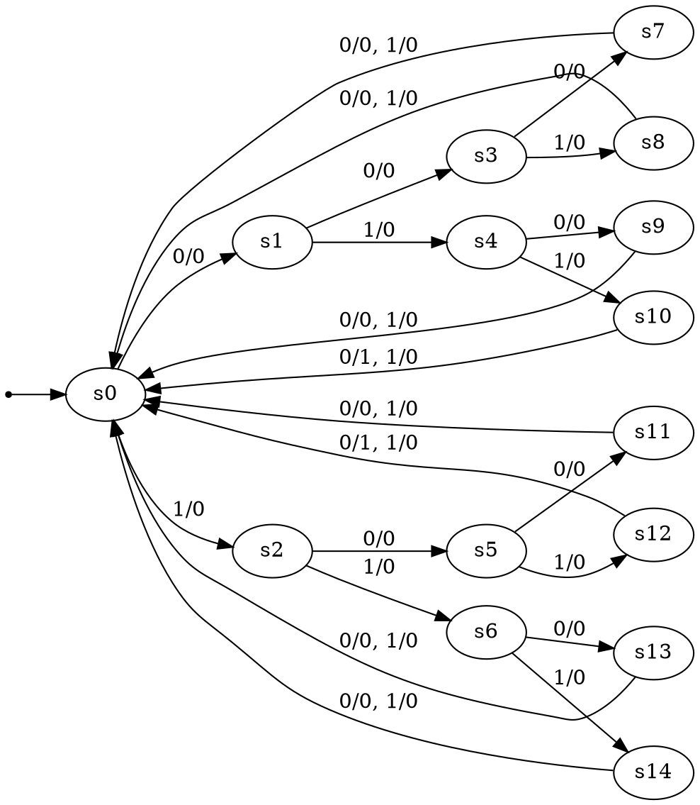
```dot
digraph STG {
	rankdir=LR;

	INIT [shape=point];
	s0 [label="s0"];
	s1 [label="s1"];
	s2 [label="s2"];
	s3 [label="s3"];
	s4 [label="s4"];
	s5 [label="s5"];
	s6 [label="s6"];
	s7 [label="s7"];
	s8 [label="s8"];
	s9 [label="s9"];
	s10 [label="s10"];
	s11 [label="s11"];
	s12 [label="s12"];
	s13 [label="s13"];
	s14 [label="s14"];

	INIT -> s0;
	s0 -> s1 [label="0/0"];
	s0 -> s2 [label="1/0"];
	s1 -> s3 [label="0/0"];
	s1 -> s4 [label="1/0"];
	s2 -> s5 [label="0/0"];
	s2 -> s6 [label="1/0"];
	s3 -> s7 [label="0/0"];
	s3 -> s8 [label="1/0"];
	s4 -> s9 [label="0/0"];
	s4 -> s10 [label="1/0"];
	s5 -> s11 [label="0/0"];
	s5 -> s12 [label="1/0"];
	s6 -> s13 [label="0/0"];
	s6 -> s14 [label="1/0"];
	s7 -> s0 [label="0/0, 1/0"];
	s8 -> s0 [label="0/0, 1/0"];
	s9 -> s0 [label="0/0, 1/0"];
	s10 -> s0 [label="0/1, 1/0"];
	s11 -> s0 [label="0/0, 1/0"];
	s12 -> s0 [label="0/1, 1/0"];
	s13 -> s0 [label="0/0, 1/0"];
	s14 -> s0 [label="0/0, 1/0"];
}
```

#### Input dot png

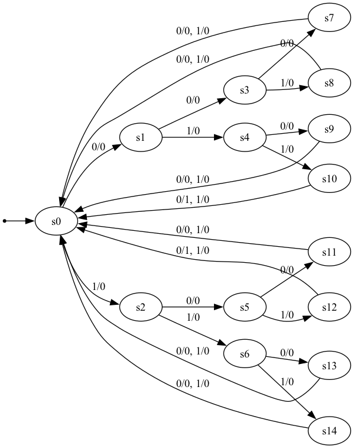


#### Output kiss

```kiss
.start_kiss
.i 1
.o 1
.p 14
.s 7
.r s0
0 s0 s1 0
1 s0 s2 0
0 s1 s3 0
1 s1 s4 0
0 s2 s4 0
1 s2 s3 0
0 s3 s7 0
1 s3 s7 0
0 s4 s7 0
1 s4 s10 0
0 s7 s0 0
1 s7 s0 0
0 s10 s0 1
1 s10 s0 0
.end_kiss
```

#### Output dot

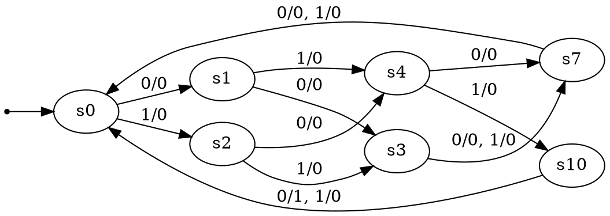
```dot
digraph STG {
    rankdir=LR;

    INIT [shape=point];
    s0 [label="s0"];
    s1 [label="s1"];
    s2 [label="s2"];
    s3 [label="s3"];
    s4 [label="s4"];
    s7 [label="s7"];
    s10 [label="s10"];

    INIT -> s0;
    s0 -> s1 [label="0/0"];
    s0 -> s2 [label="1/0"];
    s1 -> s3 [label="0/0"];
    s1 -> s4 [label="1/0"];
    s2 -> s3 [label="1/0"];
    s2 -> s4 [label="0/0"];
    s3 -> s7 [label="0/0, 1/0"];
    s4 -> s10 [label="1/0"];
    s4 -> s7 [label="0/0"];
    s7 -> s0 [label="0/0, 1/0"];
    s10 -> s0 [label="0/1, 1/0"];
}
```

#### Output dot png

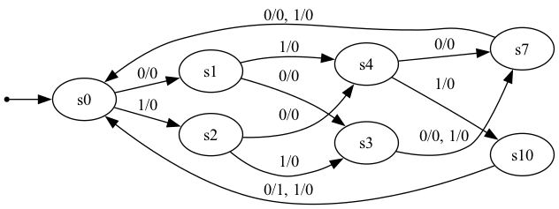


### Case 4

[example/case4](./example/myTest/kiss/case4)

#### Input kiss

```kiss
.start_kiss
.i 2
.o 1
.p 16
.s 4
.r S1
00 S1 S1 0
01 S1 S2 1
10 S1 S3 0
11 S1 S4 0
00 S2 S1 1
01 S2 S2 0
10 S2 S3 1
11 S2 S4 1
00 S3 S1 0
01 S3 S2 1
10 S3 S3 0
11 S3 S4 0
00 S4 S1 1
01 S4 S2 0
10 S4 S3 1
11 S4 S4 1
.end_kiss
```

#### Input dot

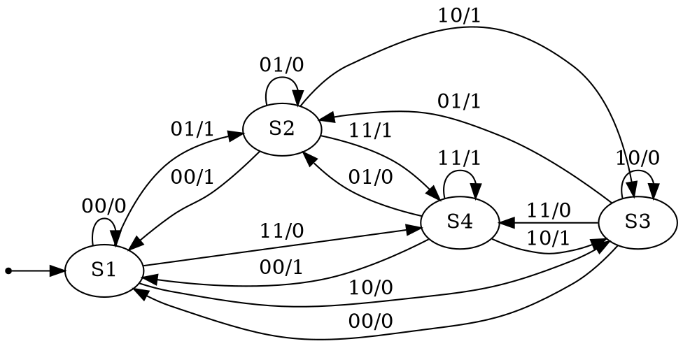
```dot
digraph STG {
	rankdir=LR;

	INIT [shape=point];
	S1 [label="S1"];
	S2 [label="S2"];
	S3 [label="S3"];
	S4 [label="S4"];

	INIT -> S1;
	S1 -> S1 [label="00/0"];
	S1 -> S2 [label="01/1"];
	S1 -> S3 [label="10/0"];
	S1 -> S4 [label="11/0"];
	S2 -> S1 [label="00/1"];
	S2 -> S2 [label="01/0"];
	S2 -> S3 [label="10/1"];
	S2 -> S4 [label="11/1"];
	S3 -> S1 [label="00/0"];
	S3 -> S2 [label="01/1"];
	S3 -> S3 [label="10/0"];
	S3 -> S4 [label="11/0"];
	S4 -> S1 [label="00/1"];
	S4 -> S2 [label="01/0"];
	S4 -> S3 [label="10/1"];
	S4 -> S4 [label="11/1"];
}
```

#### Input dot png

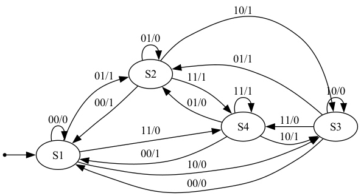


#### Output kiss

```kiss
.start_kiss
.i 2
.o 1
.p 8
.s 2
.r S1
00 S1 S1 0
01 S1 S2 1
10 S1 S1 0
11 S1 S2 0
00 S2 S1 1
01 S2 S2 0
10 S2 S1 1
11 S2 S2 1
.end_kiss
```

#### Output dot

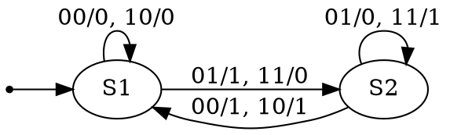
```dot
digraph STG {
    rankdir=LR;

    INIT [shape=point];
    S1 [label="S1"];
    S2 [label="S2"];

    INIT -> S1;
    S1 -> S1 [label="00/0, 10/0"];
    S1 -> S2 [label="01/1, 11/0"];
    S2 -> S1 [label="00/1, 10/1"];
    S2 -> S2 [label="01/0, 11/1"];
}
```

#### Output dot png

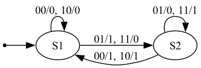


### Case 5

[example/case5](./example/myTest/kiss/case5)

#### Input kiss

```kiss
.start_kiss
.i 1
.o 1
.p 16
.s 8
.r A
0 A   B 0
1 A   C 0
0 B   D 0
1 B   E 0
0 C   F 0
1 C   A 0
0 D   H 0
1 D   G 0
0 E   B 0
1 E   C 0
0 F   D 0
1 F   E 0
0 G   F 1
1 G   A 0
0 H   H 0
1 H   A 0
.end_kiss
```

#### Input dot

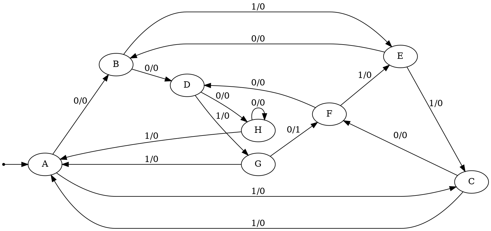
```dot
digraph STG {
	rankdir=LR;

	INIT [shape=point];
	A [label="A"];
	B [label="B"];
	C [label="C"];
	D [label="D"];
	E [label="E"];
	F [label="F"];
	H [label="H"];
	G [label="G"];

	INIT -> A;
	A -> B [label="0/0"];
	A -> C [label="1/0"];
	B -> D [label="0/0"];
	B -> E [label="1/0"];
	C -> F [label="0/0"];
	C -> A [label="1/0"];
	D -> H [label="0/0"];
	D -> G [label="1/0"];
	E -> B [label="0/0"];
	E -> C [label="1/0"];
	F -> D [label="0/0"];
	F -> E [label="1/0"];
	H -> H [label="0/0"];
	H -> A [label="1/0"];
	G -> F [label="0/1"];
	G -> A [label="1/0"];
}
```

#### Input dot png

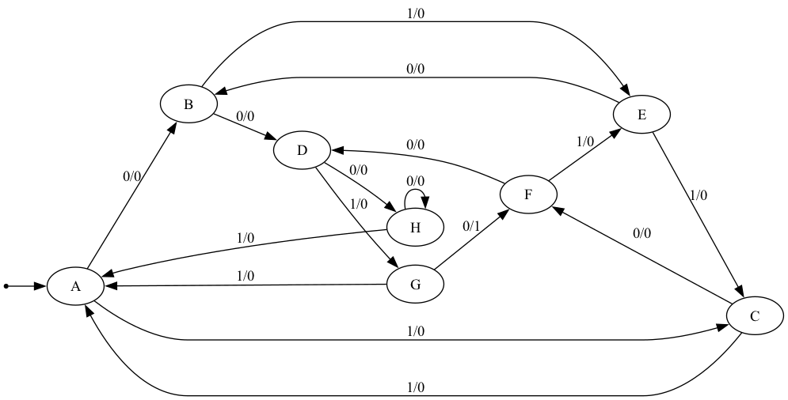


#### Output kiss

```kiss
.start_kiss
.i 1
.o 1
.p 10
.s 5
.r A
0 A B 0
1 A A 0
0 B D 0
1 B A 0
0 D H 0
1 D G 0
0 H H 0
1 H A 0
0 G B 1
1 G A 0
.end_kiss
```

#### Output dot

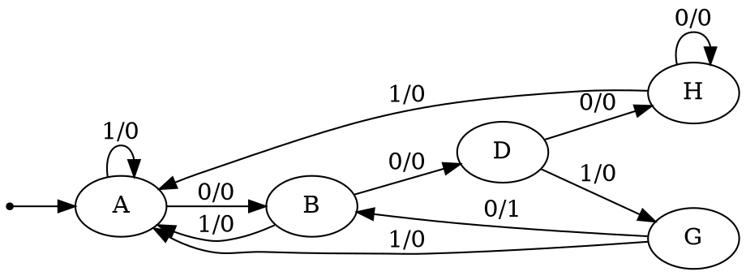
```dot
digraph STG {
    rankdir=LR;

    INIT [shape=point];
    A [label="A"];
    B [label="B"];
    D [label="D"];
    H [label="H"];
    G [label="G"];

    INIT -> A;
    A -> A [label="1/0"];
    A -> B [label="0/0"];
    B -> A [label="1/0"];
    B -> D [label="0/0"];
    D -> G [label="1/0"];
    D -> H [label="0/0"];
    H -> A [label="1/0"];
    H -> H [label="0/0"];
    G -> A [label="1/0"];
    G -> B [label="0/1"];
}
```

#### Output dot png

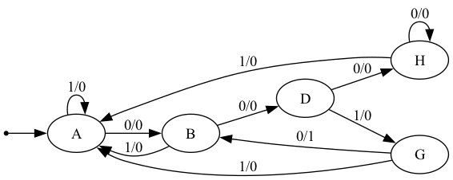


### Case 6

[example/case6](./example/myTest/testcase/test1)

#### Input kiss

```kiss
.start_kiss
.i 1
.o 1
.p 12
.s 6
.r a
0 a a 0
1 a b 0
0 b c 0
1 b d 1
0 c a 0
1 c b 0
0 d e 1
1 d f 1
0 e e 1
1 e f 1
0 f a 1
1 f c 0
.end_kiss
```

#### Input dot

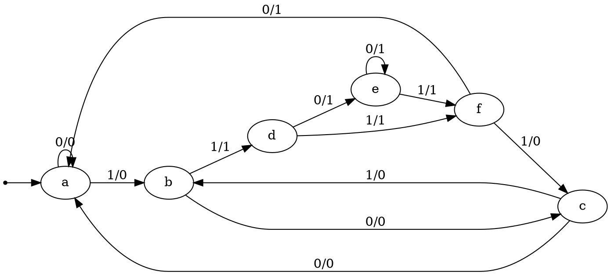
```dot
digraph STG {
	rankdir=LR;

	INIT [shape=point];
	a [label="a"];
	b [label="b"];
	c [label="c"];
	d [label="d"];
	e [label="e"];
	f [label="f"];

	INIT -> a;
	a -> a [label="0/0"];
	a -> b [label="1/0"];
	b -> c [label="0/0"];
	b -> d [label="1/1"];
	c -> a [label="0/0"];
	c -> b [label="1/0"];
	d -> e [label="0/1"];
	d -> f [label="1/1"];
	e -> e [label="0/1"];
	e -> f [label="1/1"];
	f -> a [label="0/1"];
	f -> c [label="1/0"];
}
```

#### Input dot png

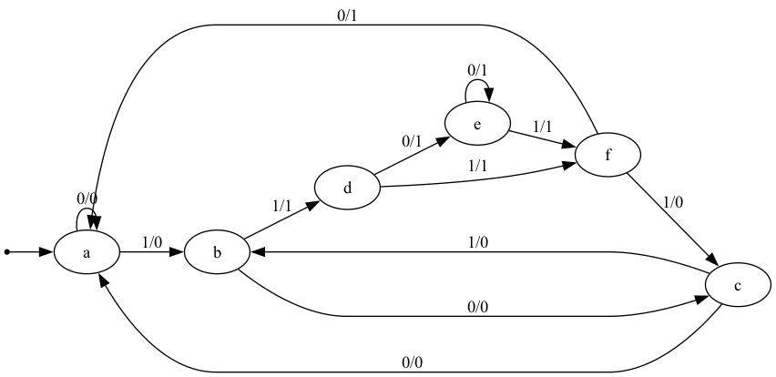


#### Output kiss

```kiss
.start_kiss
.i 1
.o 1
.p 8
.s 4
.r a
0 a a 0
1 a b 0
0 b a 0
1 b d 1
0 d d 1
1 d f 1
0 f a 1
1 f a 0
.end_kiss
```

#### Output dot

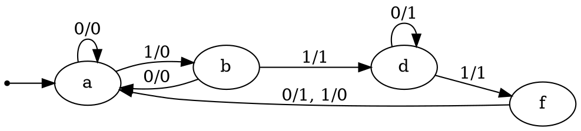
```dot
digraph STG {
    rankdir=LR;

    INIT [shape=point];
    a [label="a"];
    b [label="b"];
    d [label="d"];
    f [label="f"];

    INIT -> a;
    a -> a [label="0/0"];
    a -> b [label="1/0"];
    b -> a [label="0/0"];
    b -> d [label="1/1"];
    d -> d [label="0/1"];
    d -> f [label="1/1"];
    f -> a [label="0/1, 1/0"];
}
```

#### Output dot png

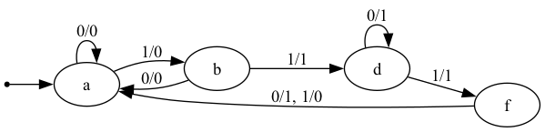


### Case 7

[example/case7](./example/myTest/testcase/test2)

#### Input kiss

```kiss
.start_kiss
.i 2
.o 1
.p 24
.s 6
.r b
00 a a 0
01 a b 1
10 a c 1
11 a d 0
00 b c 0
01 b d 1
10 b f 0
11 b e 1
00 c a 0
01 c b 1
10 c c 1
11 c d 0
00 d a 0
01 d b 1
10 d c 1
11 d d 1
00 e f 0
01 e c 0
10 e a 1
11 e b 1
00 f a 0
01 f b 1
10 f c 1
11 f d 1
.end_kiss
```

#### Input dot

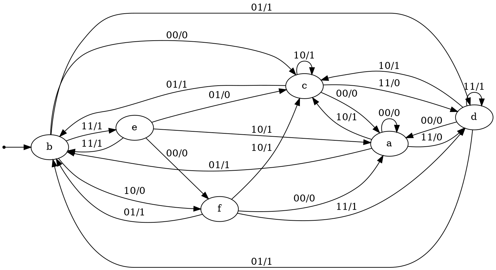
```dot
digraph STG {
	rankdir=LR;

	INIT [shape=point];
	a [label="a"];
	b [label="b"];
	c [label="c"];
	d [label="d"];
	f [label="f"];
	e [label="e"];

	INIT -> b;
	a -> a [label="00/0"];
	a -> b [label="01/1"];
	a -> c [label="10/1"];
	a -> d [label="11/0"];
	b -> c [label="00/0"];
	b -> d [label="01/1"];
	b -> f [label="10/0"];
	b -> e [label="11/1"];
	c -> a [label="00/0"];
	c -> b [label="01/1"];
	c -> c [label="10/1"];
	c -> d [label="11/0"];
	d -> a [label="00/0"];
	d -> b [label="01/1"];
	d -> c [label="10/1"];
	d -> d [label="11/1"];
	f -> a [label="00/0"];
	f -> b [label="01/1"];
	f -> c [label="10/1"];
	f -> d [label="11/1"];
	e -> f [label="00/0"];
	e -> c [label="01/0"];
	e -> a [label="10/1"];
	e -> b [label="11/1"];
}
```

#### Input dot png

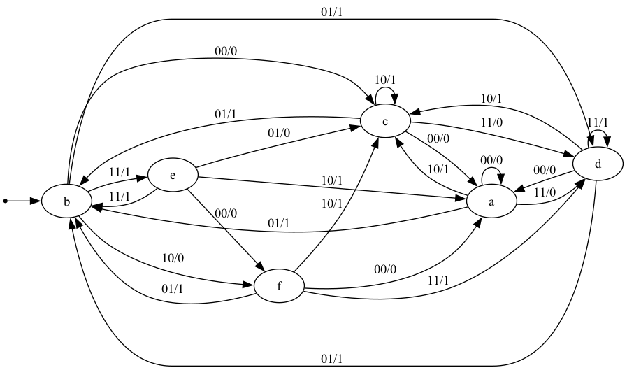


#### Output kiss

```kiss
.start_kiss
.i 2
.o 1
.p 16
.s 4
.r b
00 a a 0
01 a b 1
10 a a 1
11 a d 0
00 b a 0
01 b d 1
10 b d 0
11 b e 1
00 d a 0
01 d b 1
10 d a 1
11 d d 1
00 e d 0
01 e a 0
10 e a 1
11 e b 1
.end_kiss
```

#### Output dot

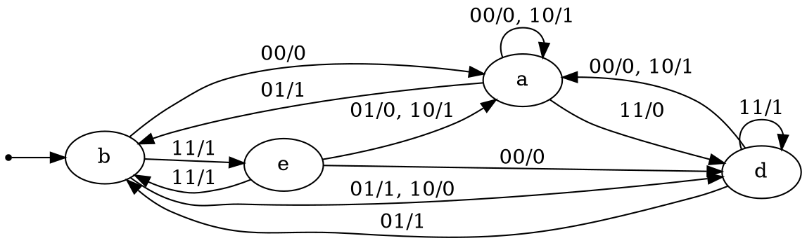
```dot
digraph STG {
    rankdir=LR;

    INIT [shape=point];
    a [label="a"];
    b [label="b"];
    d [label="d"];
    e [label="e"];

    INIT -> b;
    a -> a [label="00/0, 10/1"];
    a -> b [label="01/1"];
    a -> d [label="11/0"];
    b -> a [label="00/0"];
    b -> d [label="01/1, 10/0"];
    b -> e [label="11/1"];
    d -> a [label="00/0, 10/1"];
    d -> b [label="01/1"];
    d -> d [label="11/1"];
    e -> a [label="01/0, 10/1"];
    e -> b [label="11/1"];
    e -> d [label="00/0"];
}
```

#### Output dot png

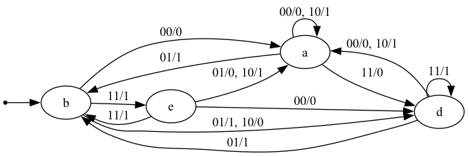


### Case 8

[example/case8](./example/myTest/testcase/test3)

#### Input kiss

```kiss
.start_kiss
.i 1
.o 1
.p 16
.s 8
.r a
0 a a 0
1 a b 0
0 b h 1
1 b g 0
0 c d 1
1 c g 0
0 d e 1
1 d f 1
0 e e 1
1 e b 0
0 f e 0
1 f c 0
0 g a 0
1 g b 0
0 h e 1
1 h f 1
.end_kiss
```

#### Input dot

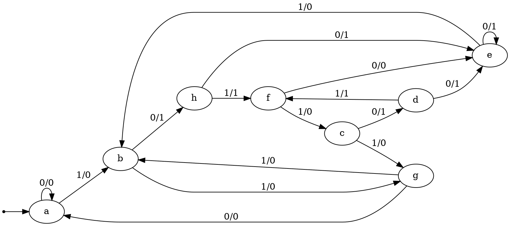
```dot
digraph STG {
	rankdir=LR;

	INIT [shape=point];
	a [label="a"];
	b [label="b"];
	h [label="h"];
	g [label="g"];
	c [label="c"];
	d [label="d"];
	e [label="e"];
	f [label="f"];

	INIT -> a;
	a -> a [label="0/0"];
	a -> b [label="1/0"];
	b -> h [label="0/1"];
	b -> g [label="1/0"];
	h -> e [label="0/1"];
	h -> f [label="1/1"];
	g -> a [label="0/0"];
	g -> b [label="1/0"];
	c -> d [label="0/1"];
	c -> g [label="1/0"];
	d -> e [label="0/1"];
	d -> f [label="1/1"];
	e -> e [label="0/1"];
	e -> b [label="1/0"];
	f -> e [label="0/0"];
	f -> c [label="1/0"];
}
```

#### Input dot png

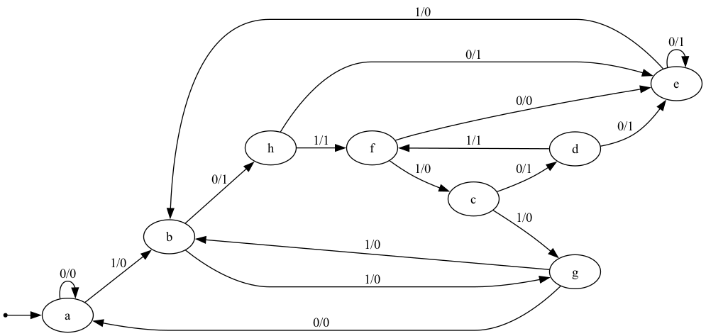


#### Output kiss

```kiss
.start_kiss
.i 1
.o 1
.p 10
.s 5
.r a
0 a a 0
1 a b 0
0 b h 1
1 b a 0
0 h e 1
1 h f 1
0 e e 1
1 e b 0
0 f e 0
1 f b 0
.end_kiss
```

#### Output dot

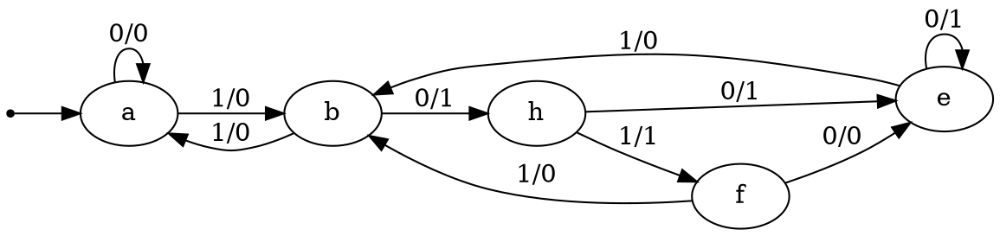
```dot
digraph STG {
    rankdir=LR;

    INIT [shape=point];
    a [label="a"];
    b [label="b"];
    h [label="h"];
    e [label="e"];
    f [label="f"];

    INIT -> a;
    a -> a [label="0/0"];
    a -> b [label="1/0"];
    b -> a [label="1/0"];
    b -> h [label="0/1"];
    h -> e [label="0/1"];
    h -> f [label="1/1"];
    e -> b [label="1/0"];
    e -> e [label="0/1"];
    f -> b [label="1/0"];
    f -> e [label="0/0"];
}
```

#### Output dot png

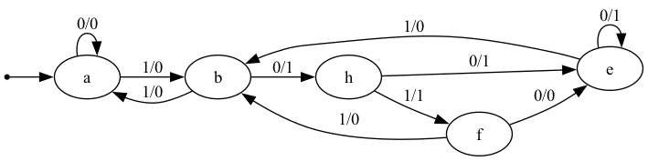


## Mine case

[example/case1](./example/testcase/case1)

#### Input kiss

```kiss
.start_kiss
.i 1
.o 1
.p 12
.s 6
.r a
0 a a 0
1 a b 0
0 b c 0
1 b d 1
0 c a 0
1 c c 0
0 d e 0
1 d f 1
0 e a 0
1 e c 0
0 f a 0
1 f c 0
.end_kiss
```

#### Input dot

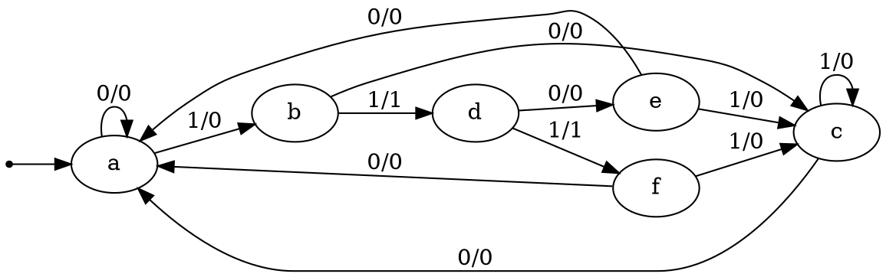
```dot
digraph STG {
	rankdir=LR;

	INIT [shape=point];
	a [label="a"];
	b [label="b"];
	c [label="c"];
	d [label="d"];
	e [label="e"];
	f [label="f"];

	INIT -> a;
	a -> a [label="0/0"];
	a -> b [label="1/0"];
	b -> c [label="0/0"];
	b -> d [label="1/1"];
	c -> a [label="0/0"];
	c -> c [label="1/0"];
	d -> e [label="0/0"];
	d -> f [label="1/1"];
	e -> a [label="0/0"];
	e -> c [label="1/0"];
	f -> a [label="0/0"];
	f -> c [label="1/0"];
}
```

#### Input dot png

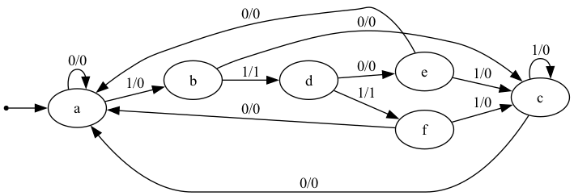


#### Output kiss

```kiss
.start_kiss
.i 1
.o 1
.p 10
.s 5
.r a
0 a a 0
1 a b 0
0 b c 0
1 b d 0
0 c a 0
1 c d 0
0 d e 0
1 d d 1
0 e a 0
1 e d 1
.end_kiss
```

#### Output dot

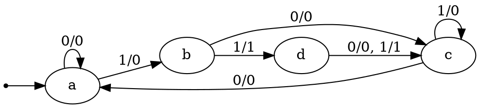
```dot
digraph STG {
    rankdir=LR;

    INIT [shape=point];
    a [label="a"];
    b [label="b"];
    c [label="c"];
    d [label="d"];

    INIT -> a;
    a -> a [label="0/0"];
    a -> b [label="1/0"];
    b -> c [label="0/0"];
    b -> d [label="1/1"];
    c -> a [label="0/0"];
    c -> c [label="1/0"];
    d -> c [label="0/0, 1/1"];
}
```

#### Output dot png

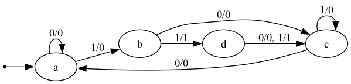


## Support

Email: allen0523win@gmail.com

Email: B11130225@mail.ntust.edu.tw 
